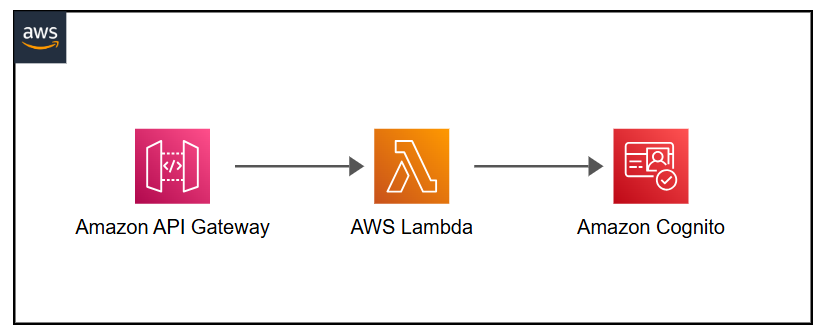

# lambda-authorizer


# AWS API Gateway with Cognito Authentication and Lambda Authorizer

This repository demonstrates how to set up an API Gateway secured with AWS Cognito for user authentication and a Lambda Authorizer for additional authorization logic. The workflow ensures that only authenticated users can access your API.

---

## Features

1. **Cognito User Pool for Authentication**:

   * Users authenticate using AWS Cognito, which issues JSON Web Tokens (JWTs) TokenID upon successful login.

2. **Lambda Authorizer for Authorization**:

   * API Gateway calls a Lambda Authorizer to validate the user's JWT and determine if they have permission to access the API.
   * If authorized, the request proceeds to the API; otherwise, an error response is returned.

3. **API Gateway**:

   * Serves as the entry point for client requests, secured with the Lambda Authorizer.

---

## Workflow

1. The user logs in using Cognito and receives an authenticated token (JWT) TokenID.
2. The user sends a request to the API Gateway with the JWT in the `authorizationToken` header.
3. The API Gateway invokes the Lambda Authorizer:

   * The authorizer validates the token and checks permissions.
   * If the token is valid and permissions are sufficient, the request is forwarded to the API backend.
   * If the token is invalid or permissions are insufficient, the API Gateway returns an "Unauthorized" response.
4. The backend returns the appropriate response to the user.

---

## Requirements

* AWS Account
* Cognito User Pool
* API Gateway
* Lambda Authorizer
* AWS CLI or AWS Management Console

---

## Setup

### 1. **Cognito User Pool**

* Create a Cognito User Pool and configure it with the desired settings.
* Note the **User Pool ID** and **App Client ID** for use in the Lambda Authorizer.

### 2. **Lambda Authorizer**

* Deploy a Lambda function to serve as the authorizer.
* The function validates the token using Cognito's public keys and checks for user permissions.


### 3. **API Gateway**

* Configure an API Gateway with the Lambda Authorizer as a custom authorizer.
* Set the `authorizationToken` header as required for all endpoints.

---

## Testing

1. Log in to Cognito to obtain a JWT token.
2. Send a request to the API Gateway with the JWT token in the `authorizationToken` header:

   ```bash
   curl -X GET https://your-api-id.execute-api.your-region.amazonaws.com/prod/resource \
        -H "authorizationToken: <your-jwt-token>"
   ```
3. **Responses**:

   * **200 OK**: If the Lambda Authorizer validates the token and grants access.
   * **403 Forbidden**: If the token is invalid or the user is not authorized.

---

## License

This project is licensed under the MIT License. See the `LICENSE` file for more details.
